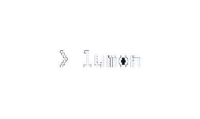
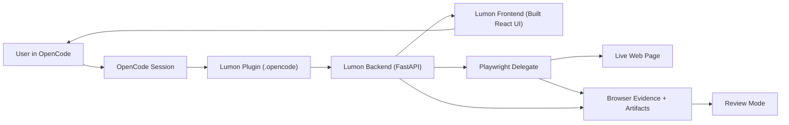

<p align="center">
  
</p>

<p align="center">
  <a href="https://github.com/lesprgm/Lumon/releases">
    
  </a>
  <a href="LICENSE">
    
  </a>
  <a href="https://github.com/lesprgm/Lumon/stargazers">
    
  </a>
</p>

<p align="center">
  <a href="https://lumon-live.netlify.app"><strong>Website</strong></a>
</p>

Lumon lets you see what your agent is doing online and step in when it matters.

It is a local visual supervision layer that sits beside an existing agent and makes online work legible:
- what the agent is doing
- where it is acting
- when a user should intervene

The product surface is a light observation UI with a large live stage, a sprite overlay, target markers, intent bubbles, approval prompts, and takeover states.

After a run completes, Lumon can also load a step-through review view from the session artifact so you can inspect where the agent went, what it targeted, and where intervention happened.

## What Lumon Supports
- `opencode` as the primary attached session source
- `playwright_native` as the only delegated visible browser runtime
- `LangChain` / `LangSmith` as an optional, non-authoritative trace bridge

Lumon does **not** ship its own browser agent. When a live browser view is needed, it uses Playwright under the hood.

## Product Model
The intended experience is simple:

1. Use plain `opencode .`
2. Lumon attaches silently in the background
3. Lumon appears when the agent is doing meaningful online work or needs intervention
4. You watch, approve, or take over when needed

This is the only supported primary user workflow. Wrapper scripts and manual multi-terminal setup are internal debug paths and are not required for normal operation.

Completed runs can then be reviewed afterward through the artifact-backed review flow instead of relying on raw logs.

## Sprite State Guide
The lobster overlay is not decorative filler. Each state maps to a real runtime condition or action class in the sprite manifest.
The current lobster sprite set started as generated pixel-art source material from Nanobanana 2. From there, the production frames were cleaned, background-fixed, normalized to a shared canvas, assembled into runtime sheets, and mapped to explicit Lumon states so the overlay reflects what the agent is actually doing instead of acting like a decorative mascot.

| State | Preview | Triggered by |
| --- | --- | --- |
| `idle` |  | Default session state, `wait`, and non-intervention observation |
| `busy` |  | `navigate`, `click`, `type`, and `scroll` actions |
| `reading` |  | `read` actions and inspection-heavy browser work |
| `success` |  | Completed browser task / successful terminal state |
| `error` |  | Failed browser task / error terminal state |
| `locomotion` |  | In-page movement path used by the overlay engine |

The actual source of truth is:
- `frontend/public/assets/lobster/runtime_manifest.json`
- `frontend/src/overlay/sprites/lobsterRuntimeManifest.ts`

## Technical Docs
Detailed architecture and component docs live in `docs/`.

Start here:
- `docs/README.md`
- `docs/ARCHITECTURE.md`
- `docs/EDGE_CASES.md`

Internally, Lumon still keeps observation and live-browser execution separate, but that distinction is not meant to be a user-facing concept.

## Current Scope
This repo is optimized for:
- local development
- demos
- video capture
- small alpha usage by technical users

It is not yet hardened for broad public internet deployment.

## Requirements
For the current local-alpha workflow, testers need:
- macOS or another Unix-like local dev environment
- Python `3.11+`
- Node.js with `npm` on `PATH`
- OpenCode installed and `opencode` available on `PATH`
- enough local permissions to install Playwright Chromium during setup

The setup flow installs:
- backend Python dependencies into `backend/.venv`
- Playwright Chromium for the delegated browser runtime
- frontend dependencies in `frontend/node_modules`
- a production frontend build in `frontend/dist`
- project-local OpenCode plugin dependencies in `.opencode/node_modules`

## Install Friction
For a technical alpha tester, install is reasonable:
- clone repo
- run `./lumon setup`
- run `./lumon doctor`
- run `opencode .`

It is **not** frictionless in a consumer sense yet.

Current friction points:
- OpenCode must already be installed separately
- Node.js / `npm` must already exist on `PATH`
- Playwright Chromium is installed during setup
- this is still a local repo install, not a packaged app
- the UI is now served from the backend's built frontend bundle, but OpenCode itself is still an external prerequisite
- if backend/plugin state drifts after code changes, `./lumon restart` is still the recovery path

## Architecture
- Backend: FastAPI session runtime, protocol validation, adapter orchestration
- Frontend: React/Vite app built once and served by the backend in normal use
- Browser runtime: Playwright
- OpenCode attach: local plugin + backend session attach

Key properties:
- per-session websocket token
- strict localhost origin allowlist by default
- explicit approval/takeover states
- structured event contract before UI rendering
- fixed viewport and overlay coordinate discipline



## Setup Once
```bash
cd <repo-root>
./lumon setup
./lumon doctor
```

Tester onboarding notes:
- if `./lumon doctor` reports missing `opencode`, install OpenCode first
- if it reports missing `npm`, install Node.js first
- the expected end-user flow after setup is plain `opencode .`
- `./lumon app`, `./lumon opencode`, and manual multi-terminal startup are internal/debug paths

If Lumon gets into a stale backend/frontend state, use:

```bash
cd <repo-root>
./lumon restart
```

If OpenCode + plugin behavior still fails and you need a shareable debug bundle:

```bash
cd <repo-root>
./lumon triage
```

This writes a report under `output/manual_checks/` with CLI checks and log tails you can share with OpenCode support (GitHub or Discord).

## Alpha Workflow
### Primary path: plain OpenCode with the project plugin
Lumon is optimized for one local-alpha workflow:
- run plain `opencode .`
- let the project-local Lumon plugin attach the session
- keep Lumon quiet by default
- only surface the UI when browser work or intervention actually matters

Use plain OpenCode:

```bash
cd <repo-root>
opencode .
```

The plugin will:
- call Lumon's local attach API on first relevant session activity
- register a real `lumon_browser` tool with OpenCode for interactive browser work
- start the Lumon backend automatically if it is not already running
- open the backend-served Lumon UI when the built frontend is ready
- keep the session observational by default
- open the Lumon UI only when browser activity or intervention becomes relevant
- reopen the Lumon UI for later browser/intervention episodes in the same OpenCode session after a cooldown

When an OpenCode model needs to interact with a page instead of just reading it, it should use the real `lumon_browser` tool path:
- `begin_task`
- `status`
- `inspect`
- `open`
- `click`
- `type`
- `scroll`
- `wait`
- `stop`

That tool path is evidence-backed:
- Lumon only reports `success` when it has matching browser evidence
- blocked high-risk steps surface a Lumon approval prompt instead of fake success text
- read-only `webfetch` stays in OpenCode and does not pretend to be a live browser run

Lumon stays quiet during repo-only work. It should feel like a mode that appears when useful, not a separate system you operate manually.

If you want a live browser view instead of pure observation:

```bash
cd <repo-root>
LUMON_PLUGIN_WEB_MODE=delegate_playwright LUMON_PLUGIN_AUTO_DELEGATE=true opencode .
```

If the plugin cannot attach cleanly, run:

```bash
cd <repo-root>
./lumon doctor
```

That prints the exact missing prerequisite instead of making you infer it from startup errors.

If the plugin, backend, and frontend drift out of sync after code changes, run:

```bash
cd <repo-root>
./lumon restart
```

### Speed Up UI Auto-Open
The Lumon plugin uses conservative defaults for when the UI auto-opens. To make it feel snappier, set these env vars before running `opencode .`:

```bash
export LUMON_PLUGIN_BROWSER_EPISODE_GAP_MS=5000
export LUMON_PLUGIN_INTERVENTION_EPISODE_GAP_MS=2000
export LUMON_PLUGIN_REOPEN_COOLDOWN_MS=3000
opencode .
```

If you want to revert to the defaults, unset those vars and restart `opencode`.

Shortcut helper (internal):

```bash
cd <repo-root>
./lumon fast-open -- .
```

That command sets the same `LUMON_PLUGIN_*` vars above and then runs the internal OpenCode wrapper. It is still an internal path, but it is handy when you want faster UI auto-open without manual exports.

### Internal Debug / Fallback (Not Required For Users)
If you want Lumon already running before OpenCode starts:

```bash
cd <repo-root>
./lumon app
```

Do not use this as the default user flow. For normal use, run plain `opencode .`.

## Internal / Debug Paths
These paths still exist for development and tests, but they are **not** the primary alpha workflow:
- `./lumon opencode`
- manual three-terminal startup
- standalone `playwright_native` demo mode

### Standalone Playwright Demo

```bash
cd <repo-root>
LUMON_HEADLESS=0 ./scripts/start_demo_backend.sh
```

Then use the frontend preview/replay flow for internal browser-surface checks.

## Testing
### Backend
```bash
cd backend
pytest -q
```

### Frontend
```bash
cd frontend
npm run test -- --run
npm run build
```

### Acceptance
```bash
cd <repo-root>
./scripts/run_acceptance.sh
```

## Security Posture
Current posture is suitable for localhost/demo use:
- docs disabled by default
- strict allowed origins by default
- per-session websocket token
- recording opt-in only

This is **not** yet a public-deployment security model. If you expose Lumon remotely, you need a stronger authenticated bootstrap/session layer and better disconnect resilience.

## UI Intent
The UI is supposed to be quiet and browser-first:
- large live webpage stage
- minimal chrome
- sprite and target markers as the main explanatory layer
- contextual intervention only when needed
- optional review mode for completed runs

It should feel like watching an agent work, not operating a dashboard.

## Review Mode
Completed sessions write local artifacts under `output/sessions/<session_id>/`.

Review mode is loaded with:

```text
http://127.0.0.1:8000/?review_session=<session_id>
```

It is a step-through review surface, not a full video scrubber. It uses milestone keyframes, exact target grounding, intervention records, and session metrics so you can understand what happened after the run.

## Known Limits
- OpenCode attach mode still depends on plugin/runtime signals plus sqlite correlation instead of a first-party OpenCode session API
- delegated Playwright is intentionally optional and is not the default product path
- remote/public deployment is out of scope for the current security model
- standalone debug paths still exist internally for tests and development, but the product workflow is plugin-first

## Repo Pointers
- Backend entry: `backend/app/main.py`
- Session runtime: `backend/app/session/manager.py`
- Session artifacts: `backend/app/session/artifacts.py`
- OpenCode adapter: `backend/app/adapters/opencode.py`
- Playwright adapter: `backend/app/adapters/playwright_native.py`
- Frontend shell: `frontend/src/App.tsx`
- Live stage: `frontend/src/components/LiveStage.tsx`
