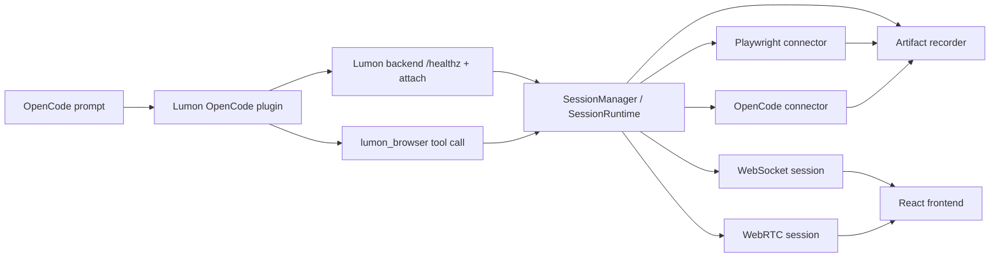

# Lumon Architecture

## System Role
Lumon is not its own browser agent. It is a local supervision and review layer that sits beside an existing agent runtime.

Today the main attached source is OpenCode. When interactive browser work is needed, Lumon delegates visible browser execution to Playwright.

## Main Runtime Boundaries
- OpenCode desktop/runtime
- project-local OpenCode plugin under `.opencode/`
- FastAPI backend under `backend/app/`
- React/Vite frontend under `frontend/src/`
- local artifacts under `output/sessions/` and `output/metrics/`

## High-Level Flow

Live state and review state are deliberately separate:
- live mode is websocket + optional WebRTC transport over the current runtime
- review mode is rebuilt later from the artifact bundle

## Core Modes
### 1. Observe-only attach
- OpenCode session is attached
- Lumon watches and records
- Lumon should stay quiet unless there is meaningful browser evidence or an intervention

### 2. Tool-backed browser delegation
- OpenCode model calls `lumon_browser`
- backend routes the command into delegated Playwright
- Lumon only reports success with browser evidence
- frontend shows a live page once a real frame exists

### 3. Review mode
- frontend loads a session artifact from `/api/session-artifacts/{session_id}`
- renders milestone keyframes, command history, interventions, and summary metrics

## Backend Entry Points
Primary API surface in `backend/app/main.py`:
- `GET /healthz`
- `POST /api/local/observe/opencode`
- `POST /api/local/opencode/browser/command`
- `GET /api/session-artifacts/{session_id}`
- `GET /api/session-artifacts/{session_id}/keyframes/{filename}`
- `WS /ws/session`

## Session Runtime Model
The central coordinator is `SessionManager`, which owns multiple `SessionRuntime` instances.

Each runtime owns:
- session identity and websocket token
- current adapter and run mode
- browser/review artifact recorder
- approval/manual-control state
- connector instance (`OpenCodeConnector` or `PlaywrightNativeConnector`)

## Adapter Split
### OpenCode adapter
- watches OpenCode session events
- emits normalized agent events into Lumon
- can escalate into delegated Playwright for browser commands
- keeps observation and browser delegation separated

### Playwright adapter
- owns browser lifecycle
- emits browser context updates and frames
- executes evidence-backed browser commands
- records exact command outcomes for artifacts and review

## Artifact Model
Artifacts live under `output/sessions/<session_id>/`.

Finalized artifact bundle files:
- `session.json`
- `events.ndjson`
- `commands.ndjson`
- `interventions.json`
- `keyframes/`

Important caveat:
- those files are not guaranteed to exist immediately when a session attaches
- live review data can be served directly from in-memory runtime state before finalize
- on-disk completeness is a finalized-session property, not an attach-time guarantee

This is the source of truth for review mode after finalize.

## Trust Model
The current repo is a localhost-first alpha design.

Important constraints:
- local-only attach and browser-command endpoints
- per-session websocket token
- strict local origin assumptions
- not a remote multi-user deployment model

## Current Architectural Weak Spots
- OpenCode still chooses whether to call `lumon_browser`; the plugin exposes the tool, but model/tool selection quality is still runtime-dependent
- startup latency is still visible because backend, frontend, and delegated browser are cold-started lazily
- observer event noise can still contaminate the user experience if not kept strictly scoped away from the main browser-command path
- browser delegation is local-only and not designed for remote orchestration
- live transport is smoother than snapshot-only fallback, but still uses image-frame transport rather than a native Chromium media pipeline

## Frame Synchronization
When the agent executes rapid back-to-back commands, the UI must remain stable and legible. Lumon solves this with two complementary mechanisms:

### Backend: Frame Sync Gate
After every `navigate` or `click` action, `BrowserActionLayer` waits for the screencast stream to emit at least one frame before proceeding to the next command. This is implemented via an `asyncio.Event` (`frame_emitted_event`) on both `CDPScreencastStreamer` and `ScreenshotPollStreamer`. The event is set after each frame is emitted and immediately cleared, creating a fresh gate for the next action.

This prevents the "blank white screen" problem where the agent has already navigated to a new page but the WebRTC stream has not yet delivered a frame to the UI.

### Frontend: Micro-Action Coalescing
The OverlayEngine (`frontend/src/overlay/engine/overlayEngine.ts`) coalesces rapid micro-actions (`read`, `wait`, `scroll`) that arrive within 250ms of each other. During the coalesce window, the engine:
- Updates the sprite's target position for smooth interpolation (the sprite curves fluidly to the final destination)
- Does **not** reset the caption or action type (preventing text flicker)
- Does **not** reset the target visual markers

This gives the user a calm, readable UI even when the agent is executing complex multi-step plans at full speed, while the Timeline panel continues to log every micro-action for full auditability.
