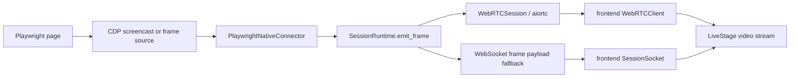

# Streaming and Transport

## Purpose
This document describes how Lumon gets a visible page into the live stage.

It separates three concepts that were previously blurred together:
- live transport
- command evidence snapshots
- review keyframes

## Current Default
Lumon defaults to:
- **WebRTC for live stage transport**
- **CDP screencast or encoded frame bytes as the frame source**
- **snapshot frames as fallback and command evidence**

This means the default live experience is **not** a `page.screenshot()` polling loop.

## End-to-End Frame Path

## Backend Pieces
### `PlaywrightNativeConnector`
File:
- `/Users/leslie/Documents/Lumon/backend/app/adapters/playwright_native.py`

Responsibilities:
- own the delegated browser runtime
- decide whether WebRTC is the primary live path
- emit browser context updates
- emit command-scoped snapshot frames for evidence
- feed live frame bytes into the session runtime

Important distinction:
- `latest_frame_generation`: latest frame seen by the runtime
- `latest_command_frame_generation`: latest frame attributable to a browser command and used for evidence verification

The bridge runtime used by the OpenCode connector must forward **both** counters. If `latest_command_frame_generation` is missing in the bridge proxy, command results degrade into `partial/frame_missing` even while a real page is live.

### `SessionRuntime`
File:
- `/Users/leslie/Documents/Lumon/backend/app/session/manager.py`

Responsibilities:
- keep the latest websocket frame payload
- feed frames into WebRTC when a WebRTC session exists
- drop duplicate websocket frame fan-out once WebRTC is ready, if configured
- replay recent browser state, frame, commands, and approvals to reconnecting clients

Relevant behavior:
- `webrtc_request` starts a per-session `WebRTCSession`
- `frame` messages still exist as the non-WebRTC fallback path
- `push_webrtc_frame_bytes()` is the direct live transport feed into aiortc

### `WebRTCSession`
File:
- `/Users/leslie/Documents/Lumon/backend/app/streaming/webrtc.py`

Responsibilities:
- accept decoded image frames
- convert them into an aiortc `VideoStreamTrack`
- negotiate offer/answer and ICE with the frontend

Current behavior:
- target FPS is controlled by `LUMON_WEBRTC_TARGET_FPS`
- queue size is intentionally small to prefer freshness over completeness
- the track keeps the last frame if no new frame has arrived yet

## Frontend Pieces
### `WebRTCClient`
File:
- `/Users/leslie/Documents/Lumon/frontend/src/lib/webrtcClient.ts`

Responsibilities:
- request a WebRTC offer over the websocket session
- accept the offer and create an answer
- surface a `MediaStream` to `App.tsx`
- detect disconnect, failure, and ended tracks

### `SessionSocket`
File:
- `/Users/leslie/Documents/Lumon/frontend/src/lib/sessionSocket.ts`

Responsibilities:
- keep the websocket session alive
- carry non-video session state
- provide the fallback frame path when WebRTC is unavailable

Important behavior:
- websocket reconnect is disabled for backend `1008` policy-violation closes
- this is deliberate so stale tabs with dead `session_id/ws_token` stop hammering the backend forever

## Live Stage Rendering Rule
LiveStage should render in this priority order:
1. active WebRTC stream when connected
2. latest websocket frame payload when WebRTC is not available
3. blank stage / quiet placeholder only when no verified frame exists yet

The stage should not pretend there is a live page when there is only observer chatter.

## Command Evidence vs Live Video
These are different things.

### Live video
Used for:
- current stage rendering
- smooth observation during browser work

### Command evidence snapshots
Used for:
- verifying that `open`, `inspect`, `click`, `type`, `scroll`, or `wait` actually produced a visible result
- writing command records
- grounding post-action artifact capture

### Review keyframes
Used for:
- milestone replay after the run completes
- browser-context changes
- interventions
- final status capture

A command can succeed without generating a new review keyframe immediately. A live frame and a review keyframe are not the same requirement.

## Runtime Modes
### Primary local runtime
Current startup script:
- `/Users/leslie/Documents/Lumon/scripts/start_demo_frontend.sh`

Default behavior today:
- use `vite preview` on `127.0.0.1:5173`
- only fall back to `vite dev` if explicitly configured

This is intentional. Detached dev servers were too fragile for the plugin-first runtime.

## Operational Notes
- Plugin or `.opencode` code changes require a full OpenCode restart.
- Backend or frontend code changes require `./lumon restart`.
- Already-open stale Lumon tabs can still be running old frontend code until reloaded or closed.

## Known Weak Spots
- WebRTC is the default live path, but it still rides on image-frame transport rather than a native Chromium media pipeline.
- Cold-start latency still comes from three places: backend, frontend, and delegated browser startup.
- Multi-tab browser flows still collapse to one active foreground page for live observation.
